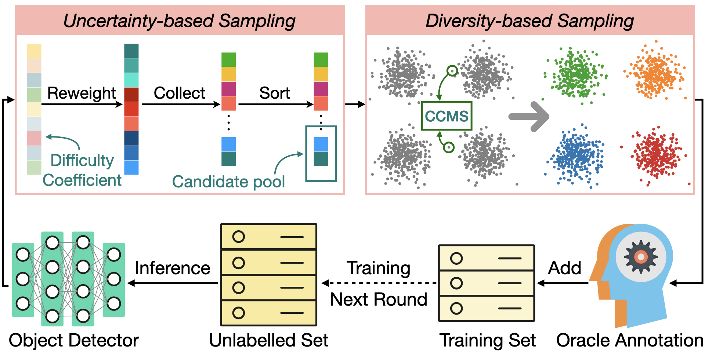

# Plug and Play Active Learning for Object Detection
<p align="center">

</p>

PyTorch implementation of our paper: [Plug and Play Active Learning for Object Detection](https://arxiv.org/pdf/2211.11612.pdf)

## Requirements

- Our codebase is built on top of [MMDetection](https://github.com/open-mmlab/mmdetection), which can be installed following the offcial instuctions.

## Usage

### Installation
```shell
python setup.py install
```

### Setup dataset
- Place your dataset as the following structure (Only vital files are shown). It should be easy because it's the default MMDetection data placement)
```
PPAL
|
`-- data
    |
    |--coco
    |   |
    |   |--train2017
    |   |--val2017
    |   `--annotations
    |      |
    |      |--instances_train2017.json
    |      `--instances_val2017.json
    `-- VOCdevkit
        |
        |--VOC2007
        |  |
        |  |--ImageSets
        |  |--JPEGImages
        |  `--Annotations
        `--VOC2012
           |--ImageSets
           |--JPEGImages
           `--Annotations
```
- For convenience, we use COCO style annotation for Pascal VOC active learning. Please download [trainval_0712.json](https://drive.google.com/file/d/1GIAmjGbg47dZFJjGYf2p-dU1z4V7pACQ/view?usp=sharing).
- Set up active learning datasets
```shell
zsh tools/al_data/data_setup.sh /path/to/trainval_0712.json
```
- The above command will set up a new Pascal VOC data folder. It will also generate three different active learning initial annotations for both dataset, where the COCO initial sets contain 2% of the original annotated images, and the Pascal VOC initial sets contains 5% of the original annotated images. 
- The resulted file structure is as following
```
PPAL
|
`-- data
    |
    |--coco
    |   |
    |   |--train2017
    |   |--val2017
    |   `--annotations
    |      |
    |      |--instances_train2017.json
    |      `--instances_val2017.json
    |--VOCdevkit
    |   |
    |   |--VOC2007
    |   |  |
    |   |  |--ImageSets
    |   |  |--JPEGImages
    |   |  `--Annotations
    |   `--VOC2012
    |      |--ImageSets
    |      |--JPEGImages
    |      `--Annotations
    |--VOC0712
    |  |
    |  |--images
    |  |--annotations
    |     |
    |     `--trainval_0712.json
    `--active_learning
       |
       |--coco
       |  |
       |  |--coco_2365_labeled_1.json
       |  |--coco_2365_unlabeled_1.json
       |  |--coco_2365_labeled_2.json
       |  |--coco_2365_unlabeled_2.json
       |  |--coco_2365_labeled_3.json
       |  `--coco_2365_unlabeled_3.json
       `--voc
          |
          |--voc_827_labeled_1.json
          |--voc_827_unlabeled_1.json
          |--voc_827_labeled_2.json
          |--voc_827_unlabeled_2.json
          |--voc_827_labeled_3.json
          `--voc_827_unlabeled_3.json
```
- Please refer to [data_setup.sh](https://github.com/ChenhongyiYang/PPAL/blob/main/tools/al_data/data_setup.sh) and [create_al_dataset.py](https://github.com/ChenhongyiYang/PPAL/blob/main/tools/al_data/create_al_dataset.py) to generate you own active learning annotation.
### Run active learning
- You can run active learning using a single command with a config file. For example, you can run COCO and Pascal VOC RetinaNet experiments by
```shell
python tools/run_al_coco.py --config al_configs/coco/ppal_retinanet_coco.py --model retinanet
python tools/run_al_voc.py --config al_configs/voc/ppal_retinanet_voc.py --model retinanet
```
- Please check the config file to set up the data paths and environment settings before running the experiments.
## Citation

```
@InProceedings{yang2024ppal,
    author    = {{Yang, Chenhongyi and Huang, Lichao and Crowley, Elliot J.}},
    title     = {{Plug and Play Active Learning for Object Detection}},
    booktitle = {Proceedings of the IEEE/CVF Conference on Computer Vision and Pattern Recognition (CVPR)},
    year      = {2024}
}
```
